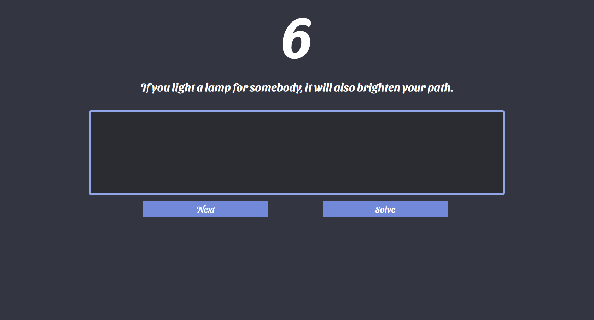

# A simple cheat for Snowflake's typing game

This repo is a module for Firefox to cheat at Snowflake's simple typing game.

## Usage

1 - Go to (the module page)[https://addons.mozilla.org/fr/firefox/addon/snowflake-typing-game-hack/]

2 - Click on "Add to Firefox"

3 - That's it ! You can now use it :)

## Usage for development

1 - Download this repo

2 - On Firefox, go to the [about:debugging](about:debugging) page

3 - Click on "Firefox" and then on "Load Temporary Add-on".

4 - Select the index.js file

5 - That's it ! You can test it on [https://ty-ping.netlify.app/](https://ty-ping.netlify.app/)

## Screenshots

